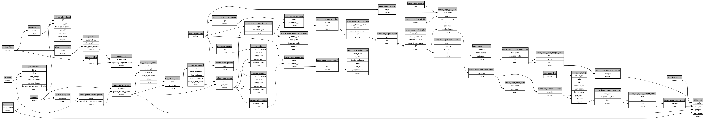

```
# AUTOGENERATED BY ECOSCOPE-WORKFLOWS; see fingerprint in README.md for details

```

```yaml
# fingerprint:
artifacts_sha256_basic: 66585a254cc33e6e615b81cf90c6120da895a0fba57241bca4464c6fde4e8647
artifacts_sha256_strict: a9dbb5accab588cd17a082e15403104bf811e6af0b69a3a8be7897c42aaa78c9
installed_requirements:
- channel: https://repo.prefix.dev/ecoscope-workflows/
  name: ecoscope-platform
  version: {version: ==2.17.1}
- channel: https://repo.prefix.dev/ecoscope-workflows-custom/
  name: ecoscope-workflows-ext-custom
  version: {version: ==0.1.0rc21}
- channel: conda-forge
  name: pydeck
  version: {version: ==0.9.2}
params_sha256: c53e8d9ffadbc12fe840a115796cfc7091cfadd93464c6b03ce137cc85bba971
spec_sha256: 8726edda2e40e814faea6fdb5474b05373a8020a988bbad8ac5b7e1f8242b468

```

# ecoscope-workflows-etd-workflow


