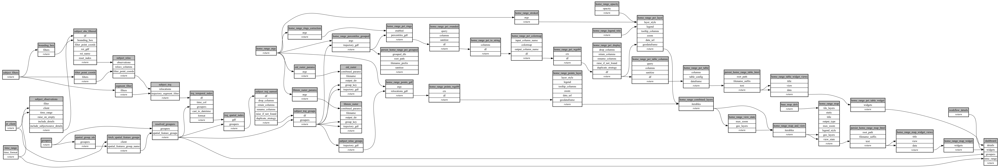

```
# AUTOGENERATED BY ECOSCOPE-WORKFLOWS; see fingerprint in README.md for details

```

```yaml
# fingerprint:
artifacts_sha256_basic: 875df673d2f7e9af049e323dc121e2dd5e6bcb3e332419a598037ff4705e1ef7
artifacts_sha256_strict: 3205f50f2fff3c984e02c36cedb791fc343261e9612c3ef9ab2ce49730715b36
installed_requirements:
- channel: https://repo.prefix.dev/ecoscope-workflows/
  name: ecoscope-platform
  version: {version: ==2.25.1}
- channel: https://repo.prefix.dev/ecoscope-workflows-custom/
  name: ecoscope-workflows-ext-custom
  version: {version: ==0.1.1}
- channel: conda-forge
  name: pydeck
  version: {version: ==0.9.2}
params_sha256: f48419238cd4a249565a9af23863479c84b79a8f692fae967d153c8bde659483
spec_sha256: 0299b6c086657f4c9f9cf49a9b13624db771f83915129dde517b653cae3c8cf6

```

# ecoscope-workflows-home-range-workflow


